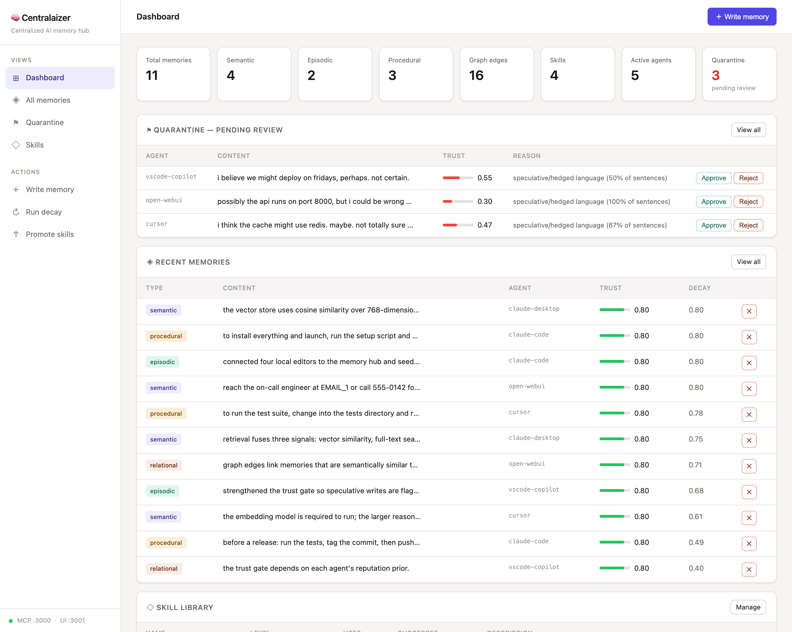
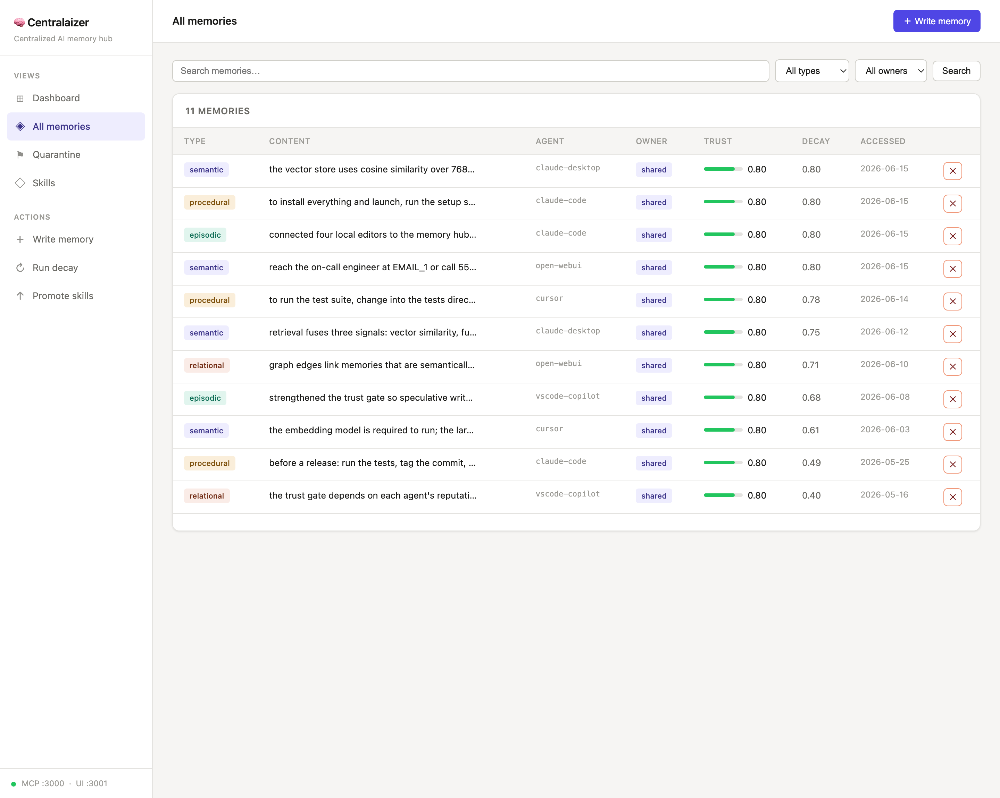
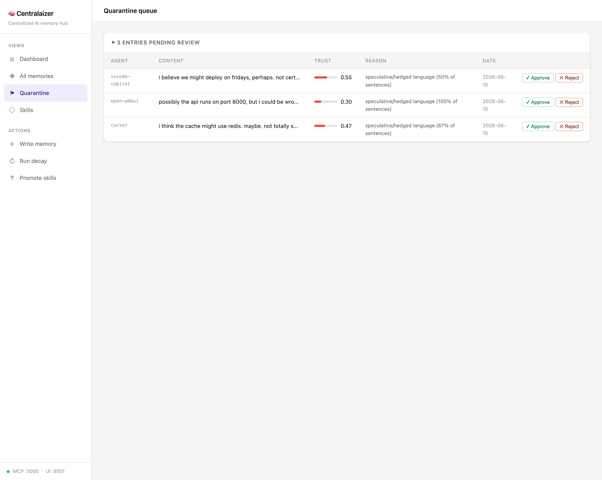
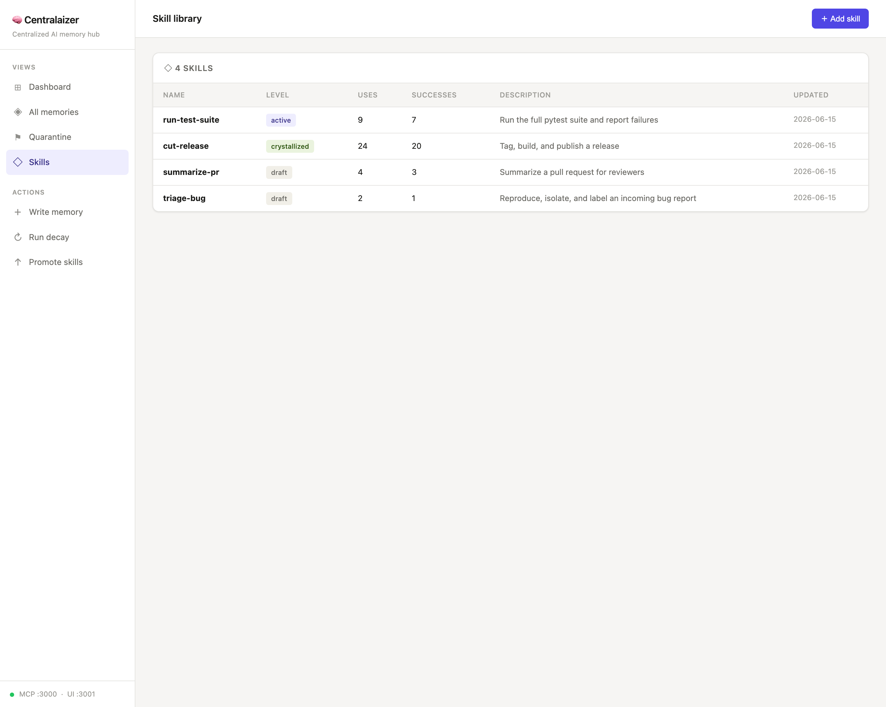

# 🧠 Centralaizer

> A local-first, privacy-preserving centralized memory hub for AI agents — MCP-compatible, zero cloud egress.

---

## What is Centralaizer?

Centralaizer solves the **memory silo problem**: every AI agent you use (Claude Desktop, Cursor, Copilot, Open WebUI, etc.) operates with its own isolated memory. Knowledge gained in one tool disappears the next day, in a different tool, or when a new conversation starts.

Centralaizer gives all your agents **one shared brain** — running entirely on your machine, with no data leaving your device.

It implements findings from 10 recent arxiv papers (2025–2026) on centralized agent memory, covering gaps in poisoning defense, multi-graph retrieval, episodic memory, privacy-preserving storage, and the stateless MCP protocol.

---

## Architecture

```
┌─────────────────────────────────────────────────────┐
│           AI Agents (your PC + browser)             │
│  Claude Desktop · Cursor · Open WebUI · VS Code     │
└────────────────────┬────────────────────────────────┘
                     │ MCP protocol
┌────────────────────▼────────────────────────────────┐
│         Local MCP Server  (localhost:3000)           │
│  Shared context store · Bayesian trust scoring       │
│  Per-agent provenance · PII masking                  │
└────────────────────┬────────────────────────────────┘
                     │
┌────────────────────▼────────────────────────────────┐
│              Core Memory Engine                      │
│                                                      │
│  ┌──────────┐ ┌──────────┐ ┌──────────┐ ┌────────┐ │
│  │ Semantic │ │ Episodic │ │Procedural│ │Relatio-│ │
│  │ (vector) │ │(sessions)│ │ (skills) │ │  nal   │ │
│  └──────────┘ └──────────┘ └──────────┘ └────────┘ │
│                                                      │
│  Memory manager: dedup · decay · conflict resolution │
└────────────────────┬────────────────────────────────┘
                     │
┌────────────────────▼────────────────────────────────┐
│         Local Storage  (100% on-device)              │
│  SQLite + FTS5 · ChromaDB · DuckDB knowledge graph   │
└────────────────────┬────────────────────────────────┘
                     │
┌────────────────────▼────────────────────────────────┐
│         Local LLM Runtime (Ollama)                   │
│  Qwen3 32B / Llama 3.3 70B · nomic-embed-text        │
└─────────────────────────────────────────────────────┘
```

---

## Research Foundation

Centralaizer is built on findings from 10 arxiv papers (2025–2026):

| # | Paper | Gap addressed |
|---|-------|---------------|
| 1 | Memory as a Service — MaaS (2506.22815) | Memory silos between agents |
| 2 | SuperLocalMemory (2603.02240) | Local-first + poisoning defense |
| 3 | MemPrivacy (2605.09530) | PII leaks to cloud LLMs |
| 4 | MAGMA (2601.03236) | Flat vector retrieval gaps |
| 5 | CA-MCP (2601.11595) | Stateless MCP servers |
| 6 | Rethinking Memory Mechanisms (2602.06052) | Missing episodic + procedural types |
| 7 | Memory as Asset (2603.14212) | No personal memory ownership |
| 8 | Memory for LLM Agents (2603.07670) | No dedup/decay/conflict management |
| 9 | MemOS (2507.03724) | No memory layering or viewer UI |
| 10 | Mem0 / State of Memory 2026 (2504.19413) | Local embeddings + multi-hop retrieval |

---

## Features

### ✅ Currently implemented

- **Local-first storage** — SQLite + FTS5 + ChromaDB + DuckDB, all on-device
- **MCP server** — one endpoint (`localhost:3000/mcp`) that any MCP-compatible agent connects to
- **Four memory types** — semantic, episodic, procedural (skills), relational (graph)
- **Bayesian trust scoring** — every write is scored; low-trust writes go to quarantine
- **PII masking** — spaCy NER + regex strips emails, phones, API keys before any LLM call
- **Multi-signal retrieval** — vector similarity + FTS5 full-text + knowledge graph expansion
- **Memory manager** — automatic deduplication, decay scoring, conflict detection
- **Skill promotion ladder** — draft → active → crystallized based on usage
- **Shared context store** — session state shared across agents in multi-step workflows
- **Local embeddings** — `nomic-embed-text` via Ollama (768-dim), 100% on-device
- **Memory Viewer UI** — full web dashboard at `localhost:3001`
  - Dashboard with live, clickable stats (cards filter/drill into detail modals)
  - All memories with search + filter; click any row for full content
  - Quarantine queue with approve/reject
  - Skill library with add + promote
- **One-command setup** — `./setup_and_run.sh` (guided installer) or **Docker** (`docker compose up`)
- **Memory export** — download the whole hub as a portable `.zip` of JSON
- **Claude Code auto-recall hook** — injects relevant memories into every prompt automatically
- **Browser bridge** — a Chrome extension brings the hub to ChatGPT / Gemini / Qwen

### 🔜 Planned (Phase 2)

- **Tauri desktop app** — wraps the web UI as a native macOS/Windows/Linux app (~5MB binary, open-source, no Electron)
- **Personal memory layer** — per-user memory slice with explicit promote-to-shared
- **Memory import** — restore/merge from an exported `.zip` (export already shipped)
- **Persisted agent reputation** — trust priors currently reset on restart
- **Temporal + causal graph edges** — richer knowledge graph beyond semantic similarity
- **Auto-summarize before archive** — Ollama call before decaying old memories

---

## Screenshots

The Memory Viewer at `http://localhost:3001` (populated with the demo dataset — see [Loading demo data](#loading-demo-data)).

**Dashboard** — live stats, the quarantine review queue, and recent memories with trust + decay:



**All memories** — search/filter by type & owner; click any row for the full content:



**Quarantine** — low-trust / speculative writes held back for human approval:



**Skills** — the draft → active → crystallized promotion ladder:



---

## Getting started

### Quick start (recommended)

One command installs everything and launches the app:

```bash
git clone https://github.com/lestercoyoyjr/Centralaizer.git
cd Centralaizer
./setup_and_run.sh
```

`setup_and_run.sh` is a guided bootstrapper. It:

1. finds a suitable Python (prefers 3.12, accepts 3.11+);
2. prints a **plan** of everything it will install — with download sizes — and marks what's already present;
3. **asks for confirmation before downloading anything**;
4. installs the virtualenv + pip packages + spaCy model + Ollama + the `nomic-embed-text` embedding model;
5. starts the Ollama server and launches `main.py`.

It's **idempotent** — re-running only fills in what's missing.

| Flag | Effect |
|------|--------|
| `--yes` | skip the confirmation prompt |
| `--no-run` | install only; don't launch the app |
| `--with-reasoning` | also pull the optional `qwen3:32b` reasoning model (~20 GB) |
| `--with-dev` | also install dev/test dependencies (pytest, ruff, mypy) |
| `--open-extension` | reveal the browser-bridge extension folder to load into Chrome |

> **macOS note:** the script installs Ollama via the official **`ollama-app` Homebrew cask**. The bare `ollama` *formula* ships without the model runtime (`llama-server`) and cannot produce embeddings — don't use it.

Once running:

| Service | URL |
|---------|-----|
| Memory Viewer UI | http://localhost:3001 |
| MCP endpoint | http://localhost:3000/mcp |

### Prerequisites

- macOS or Linux
- Python 3.11+ (3.12 recommended)
- macOS: [Homebrew](https://brew.sh) (used for the Ollama install step)

### Manual install (fallback)

If you'd rather not use the script:

```bash
python3.12 -m venv .venv
source .venv/bin/activate  # Windows: .venv\Scripts\activate
python -m pip install --upgrade pip

pip install fastmcp chromadb ollama networkx duckdb apscheduler \
            fastapi "uvicorn[standard]" jinja2 python-multipart pydantic \
            pydantic-settings rich httpx python-dotenv spacy

python -m spacy download en_core_web_sm

# Ollama runtime + embedding model (macOS shown; the formula won't work — use the cask):
brew install --cask ollama-app
ollama serve &
ollama pull nomic-embed-text
# optional reasoning model (~20 GB):
ollama pull qwen3:32b

python main.py
```

### Loading demo data

To populate the hub for a walkthrough or screenshots — memories of every type from several agents, quarantine entries, and skills at each promotion level:

```bash
python scripts/seed_demo.py --reset   # wipe existing data first, then seed
python scripts/seed_demo.py           # add demo data on top of what's there
```

Writes go through the real engine (trust gate, PII masking, vector + graph indexing), so the result mirrors a live system. Requires Ollama running for embeddings (installed by `./setup_and_run.sh`).

### Run with Docker

For a reproducible setup on any machine (no host Python/Ollama needed):

```bash
docker compose up --build
# MCP http://localhost:3000/mcp · Memory Viewer http://localhost:3001
```

The stack is two services — `centralaizer` and `ollama` — with named volumes for
the memory store and the pulled models, so data survives restarts. The container
binds `0.0.0.0` internally (ports are published to `127.0.0.1` on the host) and
the embedding model is pulled automatically on first start.

---

## Connecting your AI agents

Add this to each agent's MCP config and point it at `http://localhost:3000/mcp`:

### Claude Desktop

Edit `~/Library/Application Support/Claude/claude_desktop_config.json`:

```json
{
  "mcpServers": {
    "centralaizer": {
      "url": "http://localhost:3000/mcp"
    }
  }
}
```

### Cursor / Claude Code

Edit `.cursor/mcp.json` in your project (or `~/.cursor/mcp.json` globally):

```json
{
  "mcpServers": {
    "centralaizer": {
      "url": "http://localhost:3000/mcp"
    }
  }
}
```

### VS Code Copilot

Add to `.vscode/settings.json`:

```json
{
  "github.copilot.chat.mcpServers": {
    "centralaizer": {
      "url": "http://localhost:3000/mcp"
    }
  }
}
```

### Browser AIs (ChatGPT, Gemini, Qwen Chat)

Browser assistants run in the cloud and can't reach your local hub over MCP. The
**[browser-extension/](browser-extension/)** bridge connects them anyway: load it
unpacked and a **Recall / Remember** toolbar appears on those chat pages, talking
to your hub at `localhost:3001` (nothing leaves your machine). See
[browser-extension/README.md](browser-extension/README.md).

---

## MCP tools available to agents

| Tool | Description |
|------|-------------|
| `memory_write` | Persist a memory (trust-gated, PII-masked) |
| `memory_search` | Multi-signal retrieval (semantic + FTS5 + graph) |
| `memory_context_get` | Read shared session context |
| `memory_context_set` | Write shared session context |
| `skill_get` | Retrieve a named workflow/playbook |
| `skill_record` | Record skill outcome (drives promotion) |
| `session_start` | Begin an episodic session |
| `session_end` | Close session, persist as episodic memory |

### Suggested agent system prompt addition

```
You have access to a centralized memory hub via MCP (centralaizer).
- Before starting any task, call memory_search to retrieve relevant context.
- After completing a task, call memory_write to persist the outcome.
- For multi-step workflows, call session_start at the beginning and session_end when done.
- If a skill exists for the current task, call skill_get first, then skill_record when done.
```

---

## Testing

The test suite lives in `centralaizer-tests/` and is deliberately weighted toward **integration and end-to-end** coverage — not unit tests.

```bash
cd centralaizer-tests
../.venv/bin/python -m pytest          # 74 tests (1 skips without Docker)
```

| Layer | Scope | Count |
|-------|-------|-------|
| Unit | atomic pure logic (config merge, arg parsing, `find_python`, plan formatter, trust scoring, Docker directives) | 37 |
| Integration | features together against a real temp filesystem / sandbox; Docker compose wiring | 30 |
| E2E | full flows (agent auto-connect CLI; setup-script install → launch; Docker stack round-trip) | 7 |
| **Total** | | **74** |

Two subsystems are covered:

- **Agent auto-connect** (`agent_connect/`) — detect → merge → backup → write, with its safety guarantees: never clobbers other MCP servers, refuses to touch corrupted configs, idempotent re-runs.
- **Setup bootstrapper** (`setup_and_run.sh`) — run inside a sandbox where `brew`/`ollama`/`curl`/`python` are recording stubs. The tests assert both what the script *decides* (the plan) and what it *actually invokes* (the call log), across fresh / half-installed / fully-provisioned machine states.

### Tests with teeth

A test that can't fail tests nothing. The suite is verified to go **RED against a broken implementation** before passing against the real one. The setup tests read the script under test from `$CENTRALAIZER_SETUP_SCRIPT`, so they can be pointed at a deliberately broken bootstrapper:

```bash
# RED — 20 of 21 setup tests fail against a broken script
CENTRALAIZER_SETUP_SCRIPT=/path/to/broken.sh ../.venv/bin/python -m pytest tests/…/test_setup_*.py
# GREEN — all 52 pass against the real script
../.venv/bin/python -m pytest
```

This same RED→GREEN discipline is how the agent-connect suite was validated (run against a stubbed core first, confirming every test could fail).

---

## Configuration

Copy `.env.example` to `.env` and edit:

```env
LM_DATA_DIR=~/.localmem
LM_MCP_PORT=3000
LM_UI_PORT=3001
LM_REASONING_MODEL=qwen3:32b
LM_EMBEDDING_MODEL=nomic-embed-text
LM_TRUST_THRESHOLD=0.6
LM_DECAY_HALF_LIFE_DAYS=30
LM_MANAGER_INTERVAL_MINUTES=15
LM_SKILL_PROMOTION_THRESHOLD=5
```

---

## Project structure

```
centralaizer/
├── main.py                     # Entrypoint — starts MCP + UI + scheduler
├── setup_and_run.sh            # Guided installer + launcher (see Quick start)
├── config/
│   └── settings.py             # All settings via env vars
├── core/
│   ├── memory/
│   │   ├── engine.py           # Central memory engine
│   │   ├── models.py           # Pydantic data models
│   │   └── trust.py            # Bayesian trust scoring
│   ├── mcp/
│   │   └── server.py           # FastMCP server + tool definitions
│   ├── privacy/
│   │   └── filter.py           # PII masking (spaCy + regex)
│   └── storage/
│       ├── database.py         # SQLite + FTS5
│       ├── vector_store.py     # ChromaDB (local embeddings)
│       └── graph_store.py      # DuckDB knowledge graph
├── ui/
│   ├── app.py                  # FastAPI web app
│   ├── static/
│   │   ├── css/app.css
│   │   └── js/app.js
│   └── templates/              # Jinja2 HTML templates
│       ├── base.html
│       ├── index.html
│       ├── memories.html
│       ├── quarantine.html
│       └── skills.html
├── Dockerfile                  # containerized hub
├── docker-compose.yml          # centralaizer + ollama stack
├── browser-extension/          # bridge for ChatGPT/Gemini/Qwen
├── centralaizer-tests/         # pytest suite (74 tests)
│   ├── agent_connect/          #   auto-connect logic under test
│   ├── connect_agents_cli.py
│   └── tests/
│       ├── unit/               #   atomic logic (incl. test_setup_logic.py)
│       ├── integration/        #   features together (incl. test_setup_flow.py)
│       └── e2e/                #   full flows (incl. test_setup_e2e.py)
└── docs/
    ├── AGENT_SETUP.md
    └── DESKTOP_UI.md           # Tauri desktop app guide (Phase 2)
```

---

## Tech stack

| Component | Technology |
|-----------|-----------|
| MCP server | FastMCP |
| Vector store | ChromaDB (embedded, no server) |
| Full-text search | SQLite FTS5 |
| Knowledge graph | DuckDB |
| LLM runtime | Ollama |
| Reasoning model | Qwen3 32B / Llama 3.3 70B |
| Embedding model | nomic-embed-text |
| Privacy NER | spaCy |
| Web framework | FastAPI + Jinja2 |
| Scheduler | APScheduler |

---

## Author & contributors

Created and maintained by **Lester Confido** ([@lestercoyoyjr](https://github.com/lestercoyoyjr)).
Contributions, issues, and ideas are welcome.

---

## License

MIT — see [LICENSE](LICENSE)

---

## Status

🚧 **Active development** — Phase 1 (browser UI) complete. Phase 2 (Tauri desktop app) in progress.
